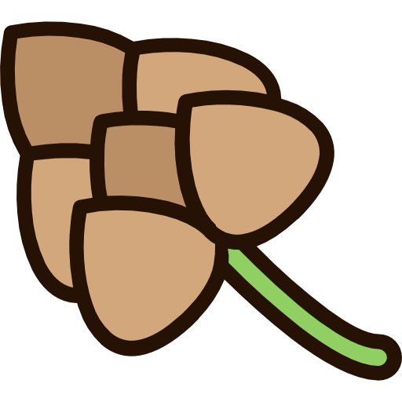

<p align="center">
  
</p>

<p align="center">
  <strong>husk</strong><br>
  Write HTML. Ship design.
</p>

<p align="center">
  <a href="https://aryanjha256.github.io/husk">Docs</a> · <a href="https://aryanjha256.github.io/husk/components">Components</a> · <a href="https://github.com/aryanjha256/husk">GitHub</a>
</p>

---

An ultra-lightweight UI library that styles semantic HTML. No classes. No build step. No framework.  
**~6 KB gzipped.** Dark mode included.

```html
<link rel="stylesheet" href="https://unpkg.com/husk-ui@latest/dist/husk.css" />
```

Your `<button>` looks like a button. Your `<dialog>` is a modal. Your `<details>` is an accordion.

## Install

```bash
npm install husk-ui
```

```css
@import "husk-ui/css";
```

Or just download [dist/husk.css](dist/husk.css) and drop it in.

## What you get

| HTML              | Result                                      |
| ----------------- | ------------------------------------------- |
| `<button>`        | Styled button (variants via `data-variant`) |
| `<article>`       | Card                                        |
| `<dialog>`        | Modal with backdrop                         |
| `<details>`       | Accordion / dropdown                        |
| `<mark>`          | Badge                                       |
| `<progress>`      | Progress bar                                |
| `<nav>`           | Navigation                                  |
| `<table>`         | Clean table with hover                      |
| `[data-tooltip]`  | Tooltip                                     |
| `[data-switch]`   | Toggle switch                               |
| `[data-loading]`  | Spinner                                     |
| `[data-skeleton]` | Skeleton loader                             |

**18 components. 0 classes.** [See them all →](https://aryanjha256.github.io/husk/components)

## Customize

```css
:root {
  --husk-accent: #e11d48;
  --husk-radius: 0;
  --husk-font: "Inter", sans-serif;
}
```

[Full token reference →](https://aryanjha256.github.io/husk/customization)

## License

MIT — [aryanjha256](https://github.com/aryanjha256)
